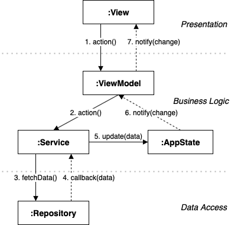
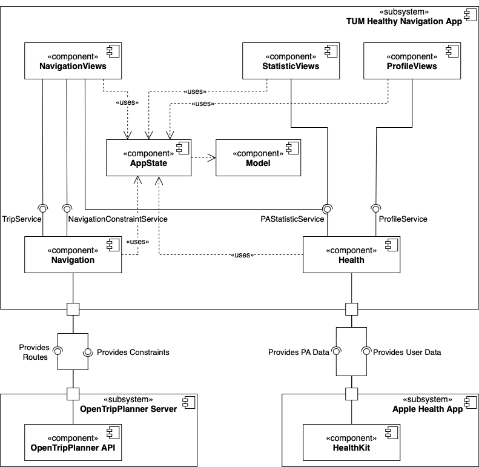
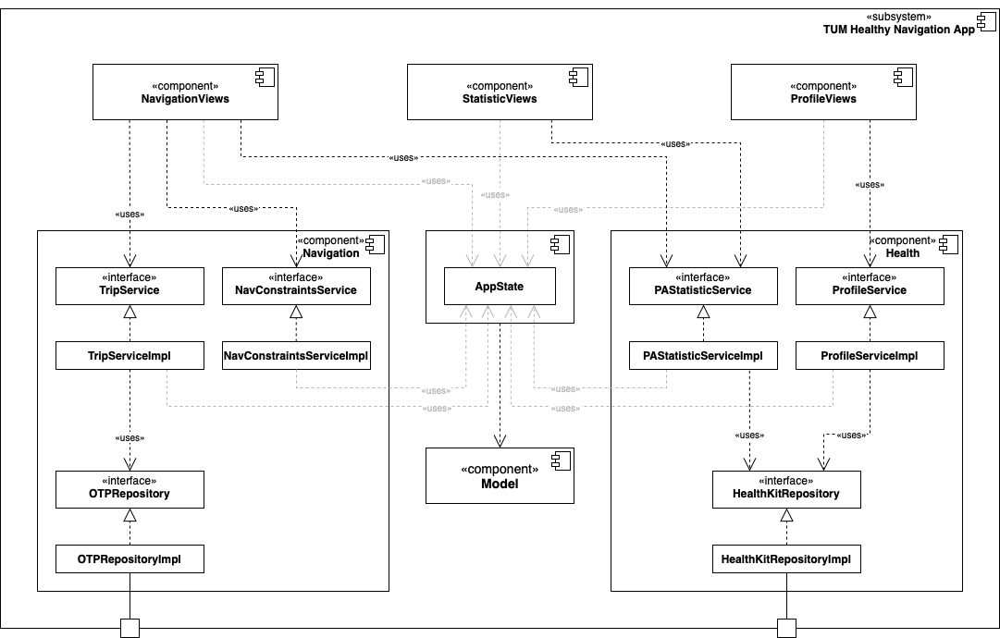

<a href="https://testflight.apple.com/join/...">

</a>

# TUM HeMo - Healthy Mobility


More than half of the European population does not reach the 150 minutes of moderate-intensity aerobic physical activity per week that is recommended by the World Health Organization.
Traditional apps in wearables and smartphones tackle this problem with different behavior change techniques (BCT).
The Apple Watch's Activity app, for example, sends prompts to stand up and move for one minute after one hour of sitting.
Although BCT like this can have a positive impact on individuals' physical activity, such activity interventions are delivered at timepoints not considering the current users' context and engagement which cloud lower the users' participation.
The HeMo app faces this issue by integrating more seamlessly in the user's everyday life.
The HeMo app aims to increase physical activity in everyday travel and changes the user's daily commute habits.
It recommends healthy routes based on different constraints the user can set such as the preferred transportation modes (Walking, Cycling, Public Transport, Car) and distance constraints.


## Architecture

The architecture of the app is made up of the following types:
- `Views` present data and trigger side effects by the user's actions (eg. tap on a button) that are forwarded to the `ViewModel`. `Views` do not contain any business logic.

- `ViewModels` serve as a intermediator between `Views` and `Services`. They contain business logic local to the `View` and delegate the triggered side effects to `Services`. `ViewModels` observe changes to the `AppState` and provide up-to-date data to the `View`.

- `Services` receive requests from `ViewModels` and perform work such as obtaining data from external resources or make domain specific computations. They forward the result to the `AppState` or to a `Binding` if the result is only locally used by one `ViewModel` and does not belong to the `AppState`.

- `Repositories` provide asynchronos interfaces for creating, updating or fetching data from external resources like databases or backend servers. `Repositories` do not contain any business logic.

- The centralized `AppState` contains data shared across the application and serves as the single source of truth.

<p align="center">
  
</p>

**Subsystem Decomposition**

`NavigationViews`,`ProfileViews` and `StatisticsViews` each contain multiple `Views` and `ViewModels`.
The `Navigation` and `Health` components each contain services and repositories. (As seen in *Detailed App Subsystem* below)

<p align="center">
  
</p>

**Detailed App Subsystem**
Interfaces decouple the *presentation* layer from the *logic* layer and the *logic* layer from the *data access* layer.
<p align="center">
  
</p>


## Installation
**App Setup**
1. Create Mapbox Account and change MGLMapboxAccessToken in Info.plist to own Default public token from Mapbox.
2. In Xcode under Signing & Capabilities: change Team, Bundle Identifier & App Group to own credentials.
3.  Connect to the TUM VPN with the AnyConnect App on your iPhone.
4. Build an run the THN app on your iPhone.

**Server Maintanance**
The OTP Server subsystem is running inside two docker containers on a VM of the chair.
The server needs the latest MVG public transport data to work properly.
When the navigation is not working with public transport inside the app it's very likely that the transport data needs to be updated.
Steps for updating the remote server with latest public transport data:
1. place the otp*.jar file in tum-health-nav-server-app/OpenTripPlanner
2. place the osm.pbf file and the gtfs.zip file in tum-health-nav-server-app/OpenTripPlanner/data/graphs/munich
3. run the following in tum-health-nav-server-app/OpenTripPlanner (can take up several minutes):
```bash
java -Xmx4G -jar otp-hechem-v2.jar --build data/graphs/munich/
```
4. push the changes to the remote repository
5. the bamboo CI/CD pipeline will automatically upload the repository to the dockerhub of the chair and restart the server on the VM (can take up several minutes)

You can also connect to the Server to monitor (eg. if the above data-update worked) or restart it manually.
For this, first connect to the Server via SSH
```bash
ssh <your TUM ID>@tumhealthynavigation.health.in.tum.de
```
